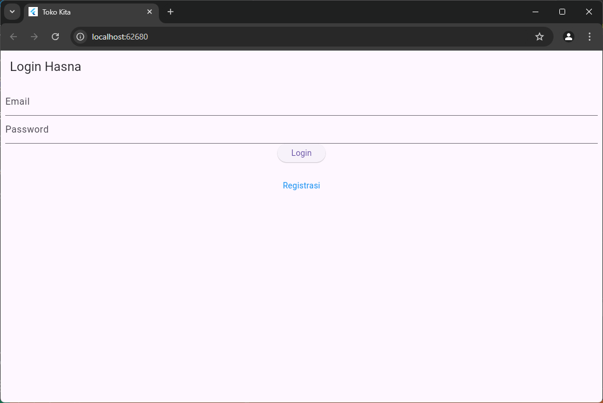

# tokokita

Hasna Mumtazah Khairunnisa
H1D022070
Shift E

## Getting Started
1. Proses Login

a. Pengguna memasukkan email dan password pada form login.

b. Setelah itu, klik tombol Login. Validasi dilakukan untuk memastikan bahwa email dan password tidak kosong.
c. Jika login berhasil, pengguna akan diarahkan ke halaman produk.

d. Jika gagal, akan muncul dialog dengan pesan "Login Gagal".

2. Proses Tambah Data Produk 

a. Pengguna mengisi Kode Produk, Nama Produk, dan Harga Produk di form.
b. Setelah form diisi, klik tombol Simpan.

3. Proses Tampil Data Produk

4. Proses Edit Data Produk

a. Pengguna memilih produk dari daftar, lalu klik tombol, Edit.
b. Pengguna dapat mengubah data produk, lalu klik tombol.

5. Proses Hapus Data Produk
a. Pengguna memilih produk dari daftar, lalu klik tombol Hapus.
b. Dialog konfirmasi akan muncul, klik Ya untuk menghapus

